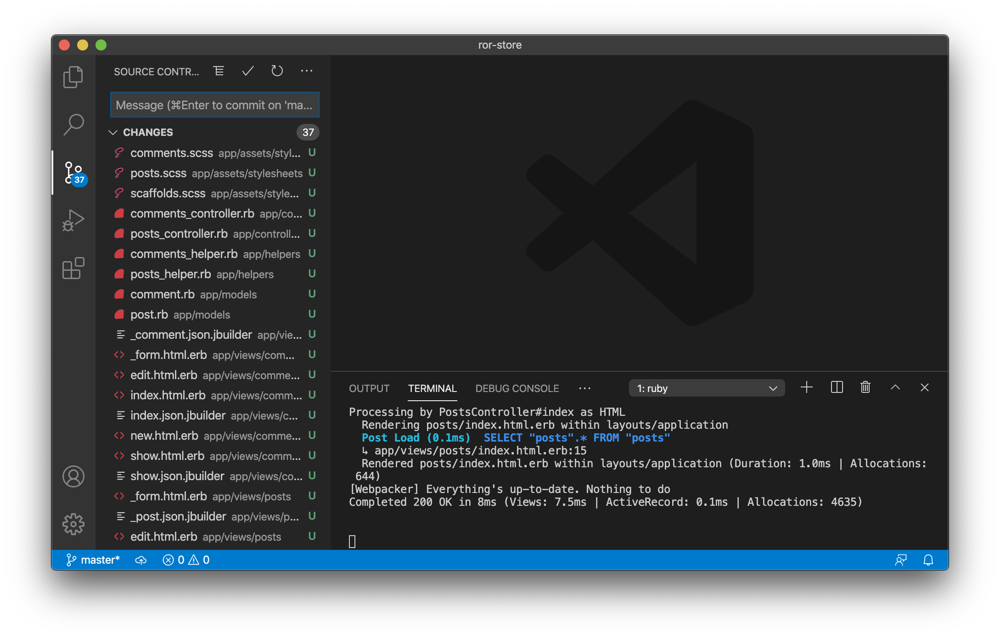
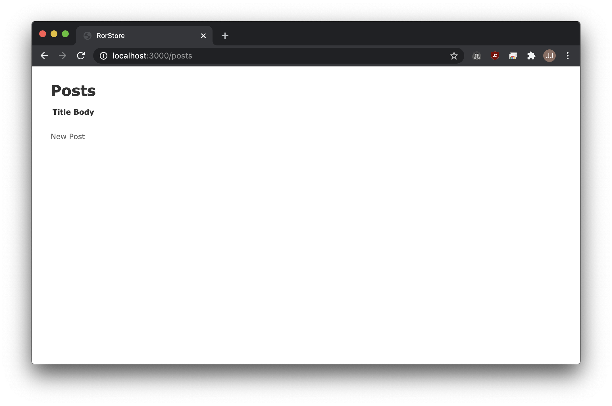
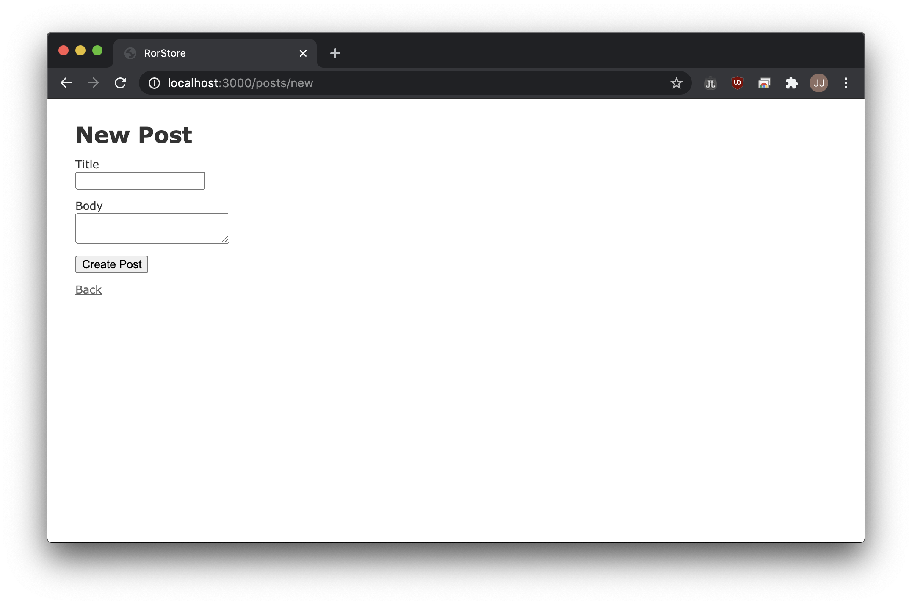
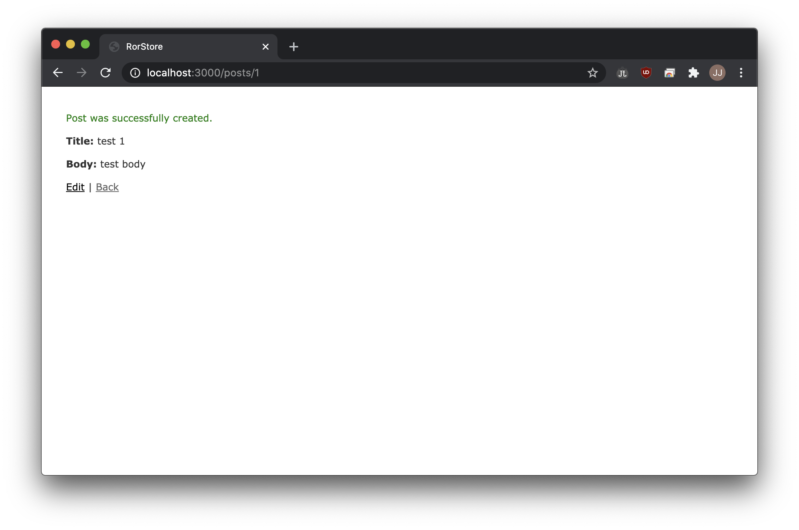
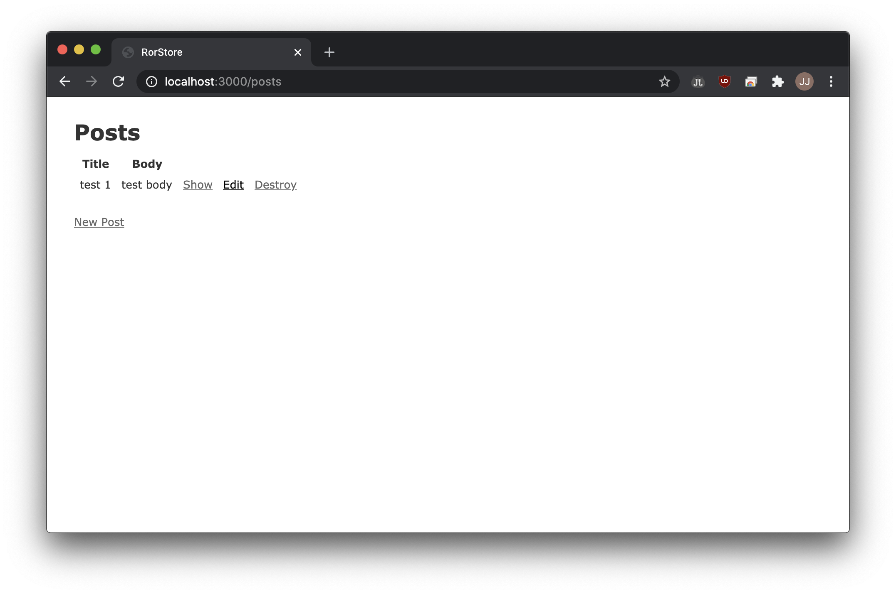
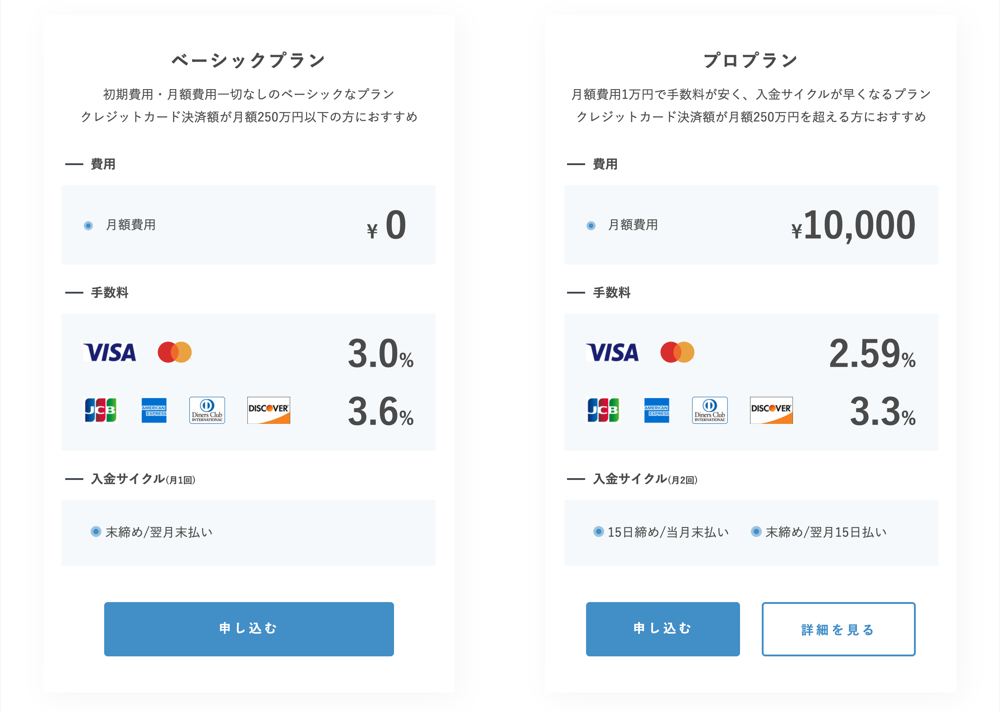

## Introduction

I was planning to create an online store using PayPal payments.
Because, I think it is simpler than using a credit card payment.
But while I was searching for a way to use PayPal api in Rails, I found it 'PAY.JP'.
So I'm going to try this.

---

## Make Blog

When I searched on Google to "create blog ruby on rails", the result was the command `rails g scaffold some parameters`. Then, what is a "scaffold"? And what does "g" mean?

### g?

"g"is alias of "generate". The rails generate command uses templates to create a whole lot of things.

### scaffod?

Scaffolding in Ruby on Rails refers to the auto generation of a simple set of a model, views and controller usually for a single table.

Then let's do it now.

```shell
rails generate scaffold post title:string body:text
rails generate scaffold comment post_id:integer body:text
rake db:migrate
rake routes
rails server
```

#### \* rake

> Rake is Ruby Make, a standalone Ruby utility that replaces the Unix utility ‘make’, and uses a ‘Rakefile’ and .rake files to build up a list of tasks.

Several files are created after execution.


Check the result on the 'localhost:3000/posts', it looks like this:

And I can make new post.

Success creating.

It is posted.


---

## PAY.JP

It has two plans.

Among them, the basic plan with a monthly payment of 0 yen caught my heart.
