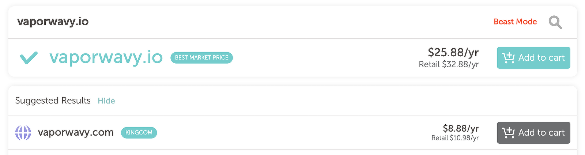
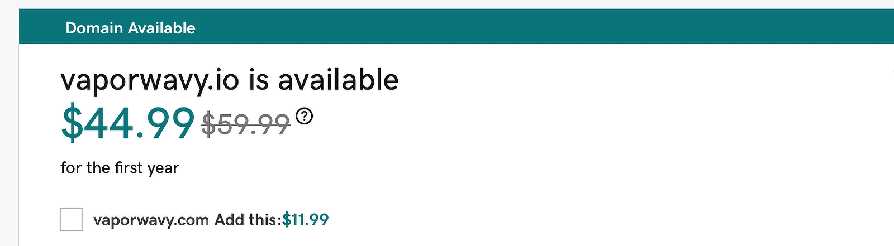
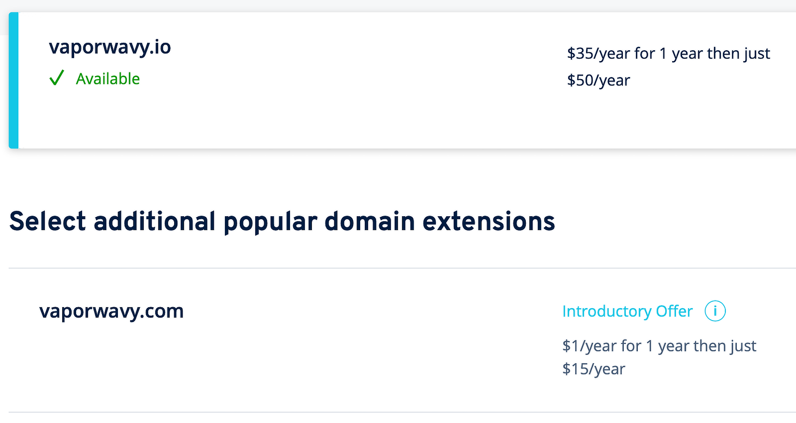
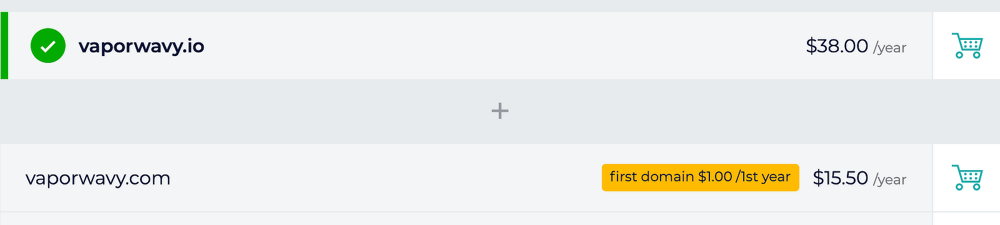
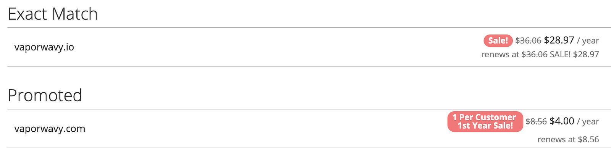

#### 1. Namecheap
https://www.namecheap.com

#### 2. GoDaddy
https://www.godaddy.com

#### 3. 1&1 IONOS
https://www.ionos.com

#### 4. Gandi
https://www.gandi.net

#### 5. Porkbun
https://porkbun.com

#### Compare price of .io + .com
|         |First year|Retail|
|---------|---------:|-----:|
|Namecheap|$34.76    |$43.86|
|GoDaddy  |$56.98    |$77.98|
|IONOS    |$36.00    |$65.00|
|Gandi    |$39.00    |$53.50|
|Porkbun  |$32.97|$37.53|

### Conclusion
This time, the best way is to buy from ***Porkbun***.