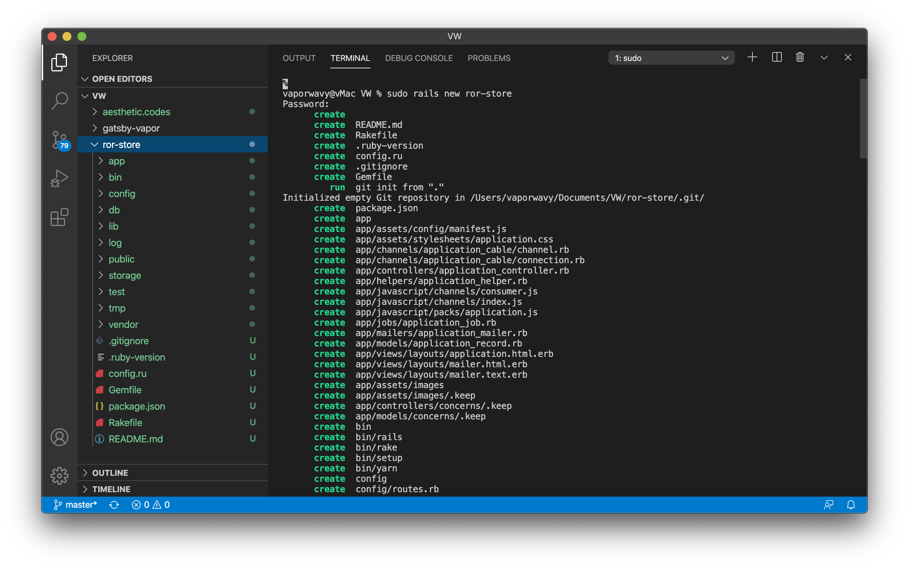
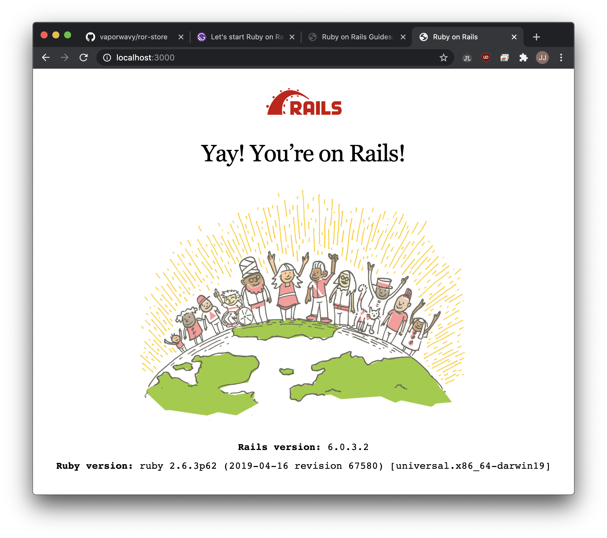

## Make new application

Create a new Rails application.

```shell
sudo rails new ror-store
```

I got a permission error, so I did it with sudo.

After execution, files are created in the ror-store directory as shown below.



Connect to a pre-made Git repository.

```shell
git remote add origin https://github.com/vaporwavy/ror-store.git
git add -A
git commit -m 'Add new rails application'
git push origin master
```

Start the server to test the build.

```shell
rails server
```

Then I got a webpacker runtime error.
I searched for this error.
This requires the installation of a webpacker. And webpacker requires the installation of yarn first.

Then install these.

```shell
brew install yarn
sudo rails webpacker:install
```

Installed the webpacker, several folders and files were added to the directory.

And if I start the server again...



Done. I'm on Rails.

`Note; The sudo was required because the current account did not have any permission for folder made by Rails(Only system was given read and write permission). It was solved by granting read-write permission to the current account.`
