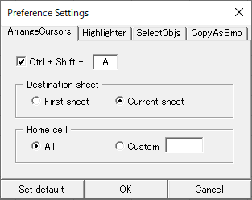

## Overview

It provides several functions for documentation in Excel.

- Arrange Cursor
- Select Objects
- Highlighter
- Copy as Bitmap

## Installation

Click
<a href="https://github.com/vaporwavy/xlr8r/archive/v1.0.2.zip" target="_blank">here</a> to download the latest version.  
Otherwise, go to the <a href="https://github.com/vaporwavy/xlr8r/releases" target="_blank">releases page</a>, download version what you want.  
Then unzip it, and execute XLR8R_Install.vbs. That's it. Now you can use XLR8R in Excel.

---

## Usage

### Arrange Cursor

Move cursor on all of the sheets in activated workbook. It ignore hidden sheets.
This has two modes. Move the cursor to cell A1, or specify the cell you want.

> Default keybind: <code class="language-text" style="font-style: normal;">Ctrl + Shift + A</code>

### Select Object

Selects all objects in the selected range or objects. In other modes, you can set the range using the mouse coordinates.

> Default keybind: <code class="language-text" style="font-style: normal;">Ctrl + Shift + S</code>

### Highlighter

It also has two modes. Create red shape, or red callout on the mouse point.

> Default keybind: <code class="language-text" style="font-style: normal;">Ctrl + Shift + D</code>

### Copy as Bitmap

Copy to clipboard as image of selected range or objects.

> Default keybind: <code class="language-text" style="font-style: normal;">Ctrl + Shift + C</code>

## Customization

You can customize on Preference Settings. Press `Ctrl + Shift + P` to open Preference Settings.

You can change keybindings, modes, and settings.

## Contributing

Visit the <a href="https://github.com/vaporwavy/xlr8r" target="_blank">GitHub</a>.
